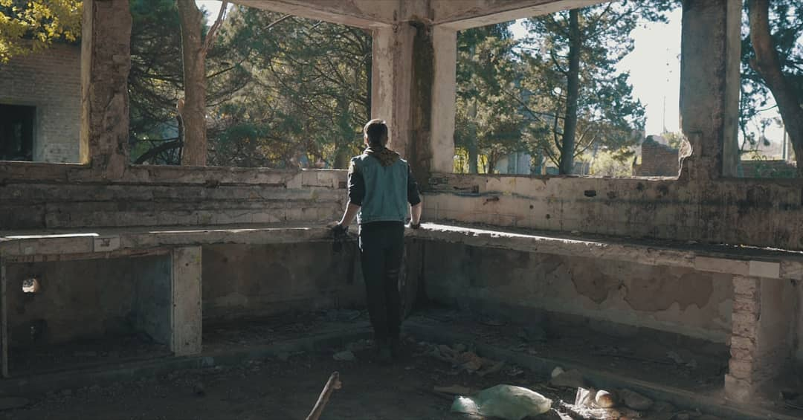
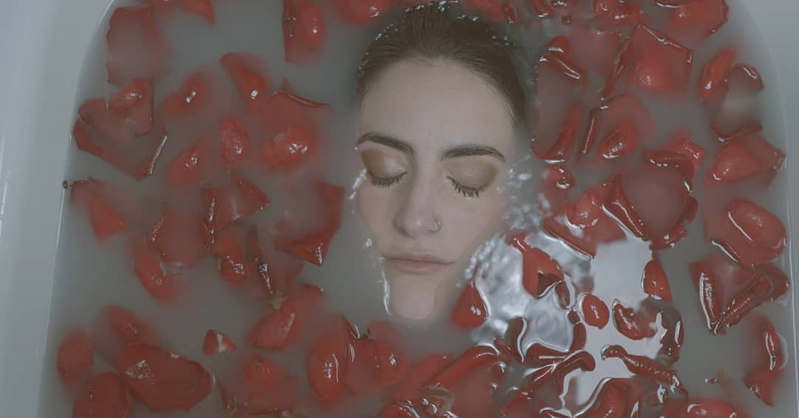
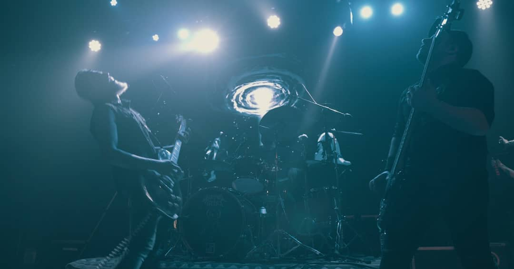
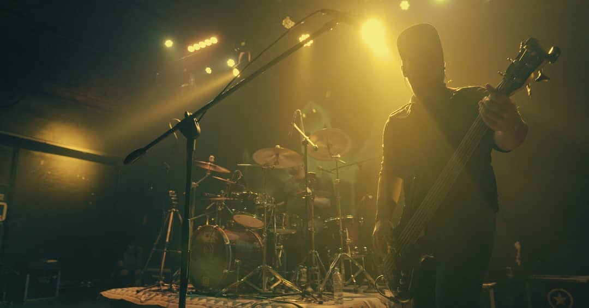
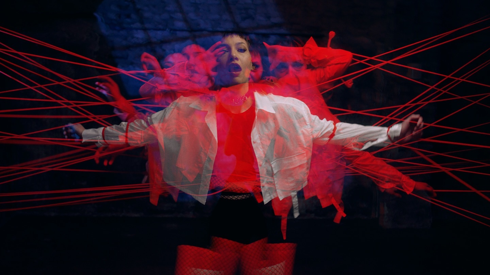

# Pánico — Sitio Web Portfolio


**Pánico** es una productora audiovisual especializada en terror y videos musicales para bandas. Este sitio web funciona como portfolio interactivo con una estética oscura y editorial, tratando al género de horror con la seriedad que se merece.

---

## Proyectos destacados

<table>
  <tr>
    <td></td>
    <td></td>
  </tr>
  <tr>
    <td><em>La casa de los huesos</em> — Largometraje, 2025</td>
    <td><em>El canto del fiambre</em> — Music Video, 2024</td>
  </tr>
</table>

<table>
  <tr>
    <td></td>
    <td></td>
  </tr>
  <tr>
    <td><em>Necrópolis</em> — Cortometraje, 2023</td>
    <td><em>Fosa común</em> — Music Video, 2021</td>
  </tr>
</table>

<table>
  <tr>
    <td></td>
    <td></td>
  </tr>
  <tr>
    <td><em>La niña del tape</em> — Largometraje, 2022</td>
    <td><em>Señales del subsuelo</em> — Video Arte, 2023</td>
  </tr>
</table>

<table>
  <tr>
    <td></td>
  </tr>
  <tr>
    <td><em>Ceibo podrido</em> — Visual Still, 2025</td>
  </tr>
</table>

---

## Sobre el sitio

Un sitio web con preloader cinematográfico, logo 3D con Three.js, scroll suave con Lenis, grano analógico, cursor personalizado y diseño de terror editorial — no un sitio de Halloween con calabazas, sino algo más cercano al cine de terror serio.

### Secciones

- **Inicio** — Hero con video a pantalla completa y letterbox cinematográfico
- **Proyectos** — Grid de trabajos con hover interactivo y showreel
- **Nosotros** — Manifiesto, catálogo de formatos, estadísticas, equipo y marquee de bandas
- **Contacto** — Formulario funcional (Formspree/EmailJS) y datos de contacto

---

## Stack

| Tecnología | Uso |
|---|---|
| Vite | Build tool y servidor de desarrollo |
| HTML + CSS + JavaScript vanilla | Sin frameworks de UI |
| Three.js | Logo 3D animado |
| Lenis | Scroll suave |
| Formspree / EmailJS | Formulario de contacto |
| Vercel | Deploy |

---

## Estructura

```
panico-web/
├── index.html
├── package.json
├── vite.config.js
├── AGENTS.md
├── docs/               → documentación por tecnología (three, lenis, etc.)
├── public/
│   ├── images/         → posters, stills y fotos del equipo
│   └── video/          → hero, showreel y clips de proyectos
├── src/
│   ├── main.js         → punto de entrada, importa e inicializa los módulos
│   ├── style.css       → estilos globales
│   ├── styles/
│   │   └── variables.css
│   └── modules/        → una funcionalidad por archivo (kebab-case)
│       ├── router.js        → navegación entre páginas (hash)
│       ├── preloader.js     → intro cinematográfica
│       ├── logo-3d.js       → logo 3D (Three.js)
│       ├── smooth-scroll.js → scroll suave (Lenis)
│       ├── hero-video.js    → video hero y letterbox
│       ├── projects.js      → grilla de proyectos, hover y showreel
│       ├── lightbox.js      → visor a pantalla completa de video/showreel
│       ├── contact-form.js  → formulario de contacto (Formspree/EmailJS)
│       ├── reveal.js        → animaciones de aparición al scrollear
│       ├── accordion.js     → acordeón de formatos en Nosotros
│       ├── cursor.js        → cursor personalizado
│       └── grain.js         → grano analógico (overlay)
```

---

## Desarrollo

```bash
npm install
npm run dev
```

---

## Contacto

- **Email:** hola@panico.agency
- **Instagram / Vimeo / TikTok:** @panico

---

*© 2026 Pánico. El miedo no tiene copyright, pero el arte sí.*
